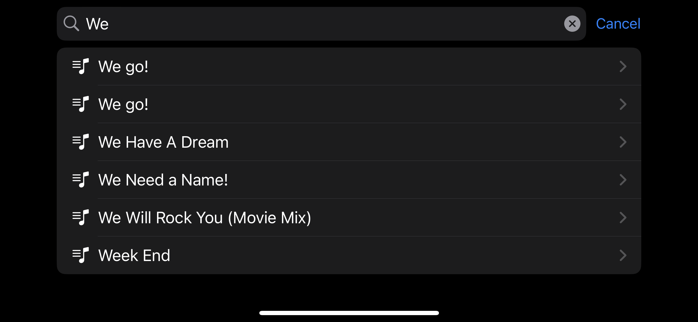
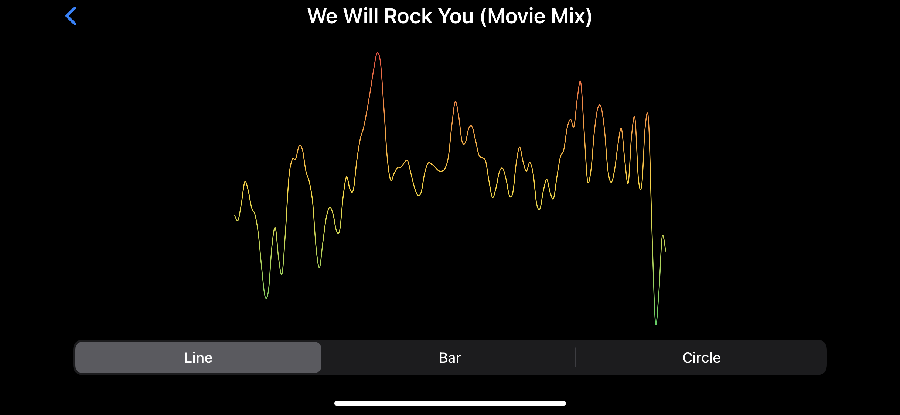
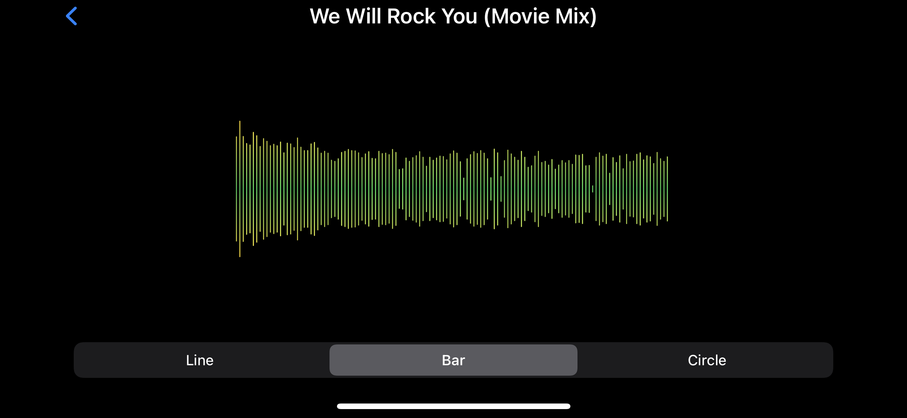
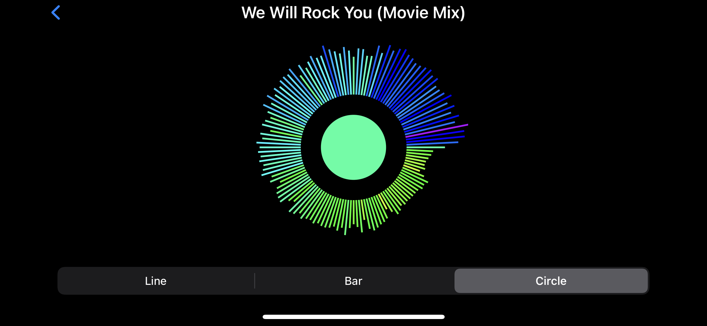

# ShootingStar

Accelerate Framework と Charts Framework を活用して作られた Audio Visualizer です。

### 概要

- ミュージックアプリから曲のリストを取得
- 曲の再生時に音源データを取得して適宜加工
- 音源データを基に SwiftUI で Audio Visualizer を表示

### スクリーンショット

